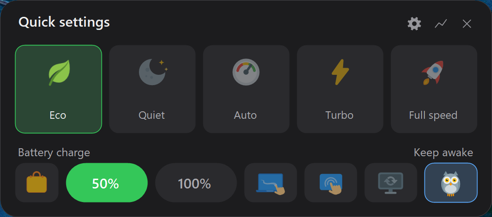
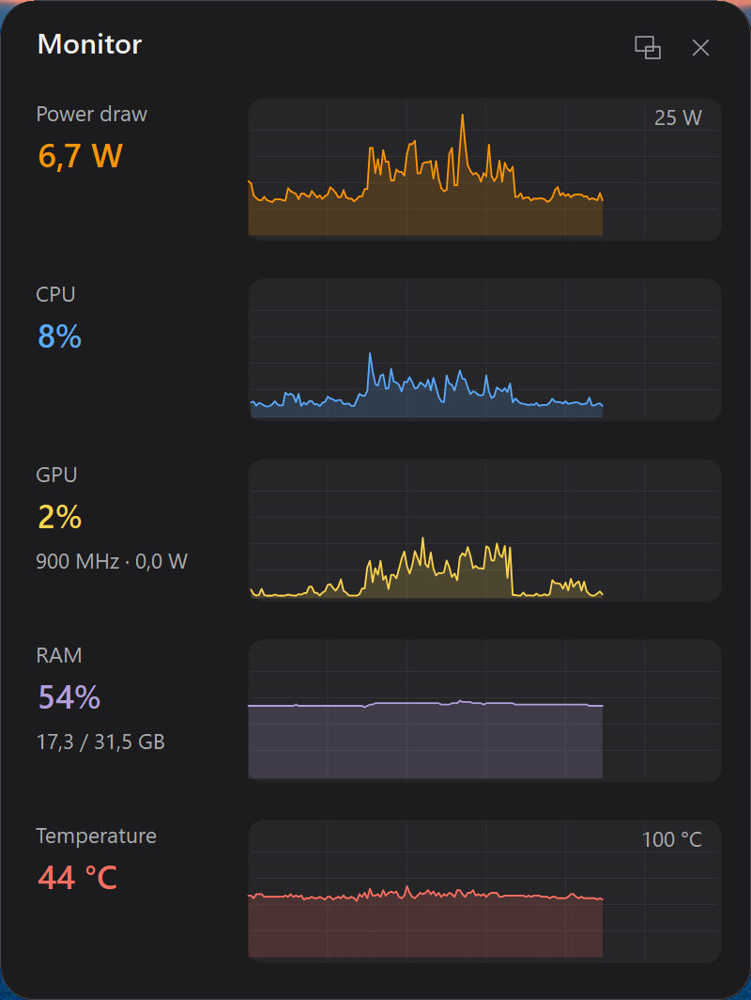

# Xi Control


[](https://buymeacoffee.com/3CLiAI1)

🌐 **English** · [Русский](README.ru.md)

A lightweight tray utility for **Xiaomi / Redmi (Redmibook)** laptops — first and foremost
for the **Xiaomi Book Pro 14 (2026)**, on which it was developed and tested, but not limited
to it. Battery charge protection, performance modes, OSD and "revival" of the vendor keys.

All hardware control goes **through the firmware's stock WMI interface** (`MiCommonInterface`,
ODM Bitland "MIFS") — the same channel the official Xiaomi PC Manager uses.
**No WinRing0**, no third-party drivers and no direct EC access.

<p align="center">
  
</p>

*Quick settings panel (hold the Mi button): five performance modes, charge limit,
"travel charge" (a one-off charge to 100%), touchpad and touchscreen on/off,
auto refresh rate and "owl mode" (stay awake).*

<p align="center">
  
</p>

*Monitor window: live graphs of power draw (W), CPU, GPU and RAM usage.*

<p align="center">
  
  &nbsp;&nbsp;
  
</p>

*In full view — live graphs: power draw (W), CPU, **GPU** (clock and watts under the percentage),
RAM, **hotspot temperature** (hot zone in cherry red) and the connected adapter's wattage. Collapses
into a compact line (Power / CPU / GPU / RAM) or a single watts readout — via the "view" button or a
double-click; current direction is shown by color (charging green / discharging orange).*

*The tray icon changes with the active mode:*

<p align="center">
  
</p>

## Features

- 🔋 **Charge protection** — "battery care" with a selectable threshold (40/50/60/70/80%,
  picked in Settings → Battery) / full charge to 100%.
  - **ChargeGuard**: the firmware drops the limit after sleep and power-source changes —
    the utility re-applies it automatically.
  - 🧳 **"Travel" mode** — a one-off charge to 100% on top of battery care: the suitcase button
    in the panel / a menu item. On reaching 100% — an OSD and a sound; unplugging the charger
    resets the mode by itself (the next plug-in is back to the threshold).
- 🔌 **Charger wattage** — when the charger is plugged in, show the connected PD adapter's
  wattage (watts) in the OSD and in the Monitor. Over the charge icon — a **PSU quality badge**:
  🔴 "!" if the adapter is weaker than the configured threshold (slow charging), ⚪ "?" if the
  PSU is non-PD (e.g. plain 5 V — wattage can't be negotiated). The icon still shows the current
  charge limit. The threshold is configurable (Settings → Battery). Driver-free (read-only).
- 🩺 **Battery health** — Settings → Battery: actual wear (current vs. design capacity),
  charge cycle count, capacity in Wh. Stock ACPI/Windows data, read-only.
- ⚡ **Performance modes**: Eco (hidden firmware mode) / Quiet / Auto /
  Turbo / Full speed. Eco and Full speed can be removed from the UI via config.
- 🖥️ **OSD overlay** (dark card, custom icons):
  - charger plug/unplug ("Charging to X%" with the actual threshold / "On battery" + level);
  - performance mode and charge limit changes;
  - microphone on/off, keyboard backlight (off / 50% / 100% / auto).
- 🅼 **Mi button**:
  - short press — cycle through modes with an OSD (configurable);
  - double click — toggle the charge limit (configurable);
  - hold — quick settings panel (modes + charge limit, closes on Esc/X/click-outside).
- ⌨️ **Reviving "dead" keys** with remapping: the Mi clicks and the "settings" / AI /
  "projection" keys can be bound to any function — from cycling modes to launching your
  own program (see "Key remapping"); the microphone key mutes the system mic, the backlight
  key shows an OSD with the level.
- 🖱️ **Touchpad on/off** — an action for any key + a cell in the panel. Disabling is done the
  stock way (like in Device Manager, no drivers) and does not survive a reboot — the touchpad
  can't get stuck disabled.
- 👆 **Touchscreen on/off** — same for the laptop's touchscreen: an action for a key,
  a cell in the panel, stock driver-free disabling and auto re-enable after a reboot.
  The cell appears only if a touchscreen is present in the system.
- ⚙️ **Settings window** in Windows 11 style — all options across tabs (General / Features /
  Battery / Display / Performance / Keys / About), dark and light themes.
  The **Features** tab controls what to show: "Owl mode", touchpad, touchscreen and refresh-rate
  control; a disabled feature disappears from the menu and panel entirely.
- 🎨 The tray icon changes with the mode, monochrome to match a light/dark taskbar;
  a dark menu matching the system theme (switches on the fly).
- 🦉 **"Owl mode"** — don't sleep, and don't turn off the display *(optional)*; a closed lid on
  AC power only turns off the display (on battery — regular sleep). Owl in the panel / a checkbox
  in the menu; power timings aren't changed, the lid action is restored afterwards.
  If you only need the machine to stay awake (for a remote session, say), set
  `"OwlIgnoreDisplay": true` in config — the screen then blanks as usual instead of burning idle.
  The feature can be hidden entirely (`"OwlMode": false` in config).
- 🖥️ **Auto refresh rate** — plug in the charger → 120 Hz, unplug → 60 Hz
  (rates configurable in config: `AcRefreshRate`/`BatteryRefreshRate`; if the panel lacks
  such a rate, the nearest one is used). A menu toggle and a panel cell;
  holds after sleep and power-source changes. Refresh-rate control can be hidden entirely
  (Settings → Features or `"RefreshRateFeature": false`) — the menu item, cell and Display tab go away.
- 🔌 **Power profiles** — your own performance mode on AC and on battery
  ("Don't change" — leave alone). Applied at startup and on power-source changes; driver-free (firmware WMI).
- 💡 **Brightness memory** — a separate option (no profiles): screen brightness is remembered
  and restored separately for AC and battery (WMI ACPI, the same channel Windows uses).
- 🌐 UI language: Russian / English / Chinese (中文).
- 🚀 Autostart via Task Scheduler (no UAC prompt at logon, works on battery).
- 🛰️ **HTTP API for the local network** (optional, **off by default**) — control it from a
  phone or from Home Assistant automations: read status and charge (`GET /status`),
  switch mode, charge protection, "travel" and owl. A command allowlist, token authorization
  (only the SHA-256 is stored), binds to `127.0.0.1` by default — network access is enabled by
  a separate toggle. See "HTTP API" below.

## Compatibility

Tested on the **Xiaomi Book Pro 14** (TM2424). Should work on Xiaomi/Redmi laptops made by
ODM Bitland with the `MiCommonInterface` WMI class (most recent-generation Redmibook / Xiaomi
Book models).

Check your machine (PowerShell):

```powershell
Get-CimClass -Namespace root/wmi -ClassName MiCommonInterface
```

If the class is found — the interface is there. The set of supported functions depends on the
model (the utility detects them at runtime and won't crash on unsupported ones).

## Installation

The easiest way — via [winget](https://learn.microsoft.com/windows/package-manager/winget/):

```powershell
winget install Oksion.XiControl
```

Or grab a prebuilt exe from the [releases page](../../releases):

- `XiControl-vX.X.X-win-x64.exe` — self-contained, nothing to install (~70 MB);
- `XiControl-vX.X.X-win-x64-net8.exe` — lightweight (~2 MB), requires the
  [.NET 8 Desktop Runtime](https://dotnet.microsoft.com/download/dotnet/8.0).

Run as administrator (a firmware WMI-interface requirement — even reading doesn't work
without elevation).

### Antivirus false positives

Xi Control is unsigned, runs as administrator and touches system things (the firmware charge
limit, refresh rate, a firewall rule for the optional HTTP API, an autostart task) — enough for
some over-eager heuristics to twitch. Easy to check: upload the exe to
[VirusTotal](https://www.virustotal.com/) — typically, out of ~70 engines only **Bkav Pro**
flags it (a generic signature like `W32.Malware.*`), while **Microsoft Defender and everyone
else stay silent**. Bkav's engine is AI/ML-based — that's the vendor's own positioning, and their
generic detection is literally named `W32.AIDetectMalware`. That kind of analysis looks for
"suspicious" code patterns common to both legitimate and malicious software — hence its notorious
reputation for false positives. It's a false positive, and it's not a bug on our side.

Why you can trust the build:

- **the source code is open** — read it and compile it yourself;
- **releases are built in GitHub Actions** from this repository (visible in the Actions logs),
  not "from someone's laptop";
- the exe is reproducible with `dotnet publish` (below) — verify it yourself.

So if your antivirus complains, it's a reason for it to apologize, not for you to panic. If you
like, report the file to the vendor as a false positive: such generic signatures usually fall off
with the next database update.

Build from source:

```powershell
dotnet build XiControl.sln -c Release
# → src/bin/x64/Release/net8.0-windows/XiControl.exe
dotnet test XiControl.sln -c Release --no-build   # unit tests (no hardware required)
```

A single portable .exe (without .NET installed):

```powershell
dotnet publish src/XiControl.csproj -c Release -r win-x64 --self-contained -p:PublishSingleFile=true
```

## Usage

Launch `XiControl.exe` (confirm the UAC prompt) — a tray icon appears.

| Action | Result |
|----------|-----------|
| Click the tray icon | Quick settings panel |
| Right-click the icon | Menu: charge, "travel", owl, auto refresh rate, Monitor, mode, Settings…, exit |
| Mi button, single click | Next performance mode + OSD *(configurable)* |
| Mi button, double click | Toggle charge limit threshold ↔ 100% + OSD *(configurable)* |
| Mi button, hold ~0.5 s | Quick settings panel |
| Microphone key | Mute/unmute the system microphone + OSD |
| "Settings" key | Toggle charge limit threshold ↔ 100% + OSD *(configurable)* |
| Keyboard backlight key | OSD with the level (off / 50% / 100% / auto) |

All options live in the **Settings…** window (tray menu item): tabs General (language,
autostart, panel theme, brightness memory), Features (owl, touchpad, touchscreen, refresh-rate
control), Battery ("travel" sound), Display (auto refresh rate and rates; the tab is hidden if
refresh-rate control is off), Performance (mode visibility, startup mode, power profiles),
Keys (remapping) and About. The quick toggles (charge, "travel", owl, refresh rate, Monitor,
mode) stay in the tray menu and the panel.

Fine timings are edited only in `%APPDATA%\XiControl\config.json` (applied on the next
launch): `MiHoldMs` — the Mi-button hold threshold (400), `MiDoubleClickMs` — the double-click
window (300), `OsdDurationMs` — how long the OSD stays up (2800).

For autostart, enable "Start with Windows" (Settings → General) — the scheduler task is created
elevated, so there's no UAC prompt at logon; if the task points to a missing exe (you updated or
moved the file), it repairs itself on launch.

### Travel mode (a one-off charge to 100%)

You usually keep battery care on (say, 80%), but before a trip you want a full charge. Press the
**suitcase button** in the panel (left of the threshold/100 pills) or the **"Charge for the road"**
menu item — the utility lifts the limit once and tops up to 100%.

- On reaching **100%** — a "ready for the road" OSD and a sound (toggle
  **Settings → Battery → "Ready sound"**, on by default).
- **Unplug the charger → the mode turns off by itself**; the next plug-in is back to the care threshold.
- Manually picking the threshold/100 pill also cancels the mode. With a permanent "100%" the button is
  inactive (nothing to top up).

The "threshold/100" pills show the **base** setting — "travel" is a temporary override on top of it
(driver-free, the same charge WMI channel). In `config.json`: `"TravelMode"`, `"TravelSound"`.

A custom ready sound — the "Custom sound file" field in the same settings (or `config.json`;
empty or a missing file → the built-in jingle; `%VARIABLES%` are supported; WAV/PCM only):

```json
"TravelSoundFile": "C:\\Users\\Me\\Sounds\\ready.wav"
```

### Hide unused modes

The toggles **Settings → Performance → "Show the Eco mode" / "Show Full speed"**
(applied immediately; the panel doesn't shrink — the cells of the remaining modes stretch).
Same in `%APPDATA%\XiControl\config.json` (you then won't be able to enable a hidden mode from
the app):

```json
"EcoMode": false,
"FullSpeedMode": false
```

- **Eco** — a hidden firmware mode absent from the official software (on the tested model it turns
  off the keyboard backlight and lowers screen brightness — the most economical profile);
- **Full speed** — if you don't use it or want to prevent accidental activation
  (the mode is loud and only works on AC).

Both are shown by default. After editing the config by hand, restart the app.

### Startup performance mode

The firmware resets the mode on reboot. What to enable at startup is a radio choice
**Settings → Performance → "Mode at startup"** (mutually exclusive; the fourth,
"Power profiles", is below):

- **Don't touch** — leave whatever the firmware set.
- **Restore last** — the app remembers the selected mode and brings it back after a reboot
  (follows your switches). On enabling it records the current one right away.
- **Pin current** — fixes **one** mode: it will be enabled every startup, whatever you shut down
  from. You pick it while in the desired mode — that one gets pinned.

If the desired mode is unavailable at startup (e.g. "Full speed" on battery), "Auto" is enabled.

The pinned mode can also be set by editing `config.json`: `"ForceStartMode": "Eco"` (allowed:
`"Quiet"` / `"Turbo"` / `"FullSpeed"` / `"Auto"` / `"Eco"`; `null` or removing the line clears it).

### Power profiles (mode by power source)

The fourth "Mode at startup" option: **your own performance mode on AC and on battery**.
Selected in the same place — **Settings → Performance → "Power profiles"**;
below the radio choice appear "Mode on AC" and "Mode on battery" (or "Don't change").

```json
"PowerProfiles": true,
"AcPerfMode": "Turbo",       // mode on AC; null or "Don't change" — leave alone
"BatteryPerfMode": "Quiet"   // mode on battery
```

- **The profile is applied at startup and on every power-source change** AC↔battery (and after
  sleep), through a debounced guard — like charge protection and auto refresh rate. Driver-free:
  firmware WMI `0x08`.
- If the firmware rejected the mode (e.g. "Full speed" on battery) — a soft fallback to "Auto".

### Screen brightness memory

A separate option **Settings → General → "Remember screen brightness"** (**off** by default),
independent of "Power profiles". The utility tracks your brightness separately for AC and battery
and restores it on each transition: you set 80% on AC → the next plug-in returns 80%. Driver-free:
WMI `WmiMonitorBrightness*` (ACPI backlight, the same channel Windows uses).

- Xi Control **overrides Windows' brightness** with its value — which is why the option is enabled
  explicitly; a transition may briefly do a double adjustment (Windows → ours ~1.5 s later).
  `AcBrightness`/`BatteryBrightness` in config fill themselves in.
- Mode and brightness changes run **in the background** (the UI isn't blocked); on a panel without
  WMI brightness the feature degrades silently (logs to `log.txt`, doesn't crash). Config writes are
  debounced (sparing the SSD).

### Auto refresh rate (screen rate by power source)

The screen switches to a different rate depending on the power source: on AC — higher (smoothness),
on battery — lower (savings). Enabled from the tray menu item, a panel cell, or in
**Settings → Display**; the rates are picked there too (applied immediately). In `config.json`:

```json
"AutoRefreshRate": true,
"HoldRefreshRate": false,
"AcRefreshRate": 120,
"BatteryRefreshRate": 60
```

How it actually behaves (plain Win32 `ChangeDisplaySettings`, no driver needed):

- **The laptop's built-in panel only**, resolution and color depth are untouched — only the rate
  changes. External monitors are never touched, even when one of them is set as primary; if the
  panel isn't currently active (lid closed, "second screen only") nothing changes at all.
- **The nearest supported rate** at the current resolution is taken: you asked for 120, the panel
  can only do 90/60 → it picks 90 (ties go to the higher). So entering "144" on a 60 Hz matrix is
  safe — it just stays 60. A value ≤ 0 in config is ignored.
- **Triggers** at app startup, on AC↔battery changes and on wake from sleep (the latter two are
  debounced ~1.5 s, events arrive in bursts), and immediately when you enable the option.
- If the desired rate **is already set — the screen doesn't blink** (no redundant call is made).
- The rate is written to the display registry (`CDS_UPDATEREGISTRY`), i.e. it **survives a reboot**;
  but with the option off the app **doesn't touch the rate at all** (including at the moment you
  uncheck it — whatever was set stays, restore it manually).
- The actual mode switch runs **on a background thread** (doesn't block the UI), and a failure is
  merely logged to `log.txt`, the app doesn't crash. The power-change OSD appends the actual rate ("… • 120 Hz").

When editing `AcRefreshRate`/`BatteryRefreshRate` directly in the config, restart the app
(a choice in the settings window applies immediately; a non-standard value from the config is shown too).

**"Keep refresh rate"** (`HoldRefreshRate`, off by default) — a separate toggle in the same
**Settings → Display**. With it, auto refresh rate watches the screen itself, not just the power
source: if the mode is changed by someone else — Windows settings, another utility, the driver after
a reset — the configured rate is restored through the same ~1.5 s debounce. Without it the setting
quietly stops holding until the next power event. It works on top of auto refresh rate (with it off
there is nothing to restore), so the toggle is greyed out while auto rate is disabled. No polling:
the system's display-mode-changed event only.

> An expected side effect, and the point of the feature: while the option is on, you can't change
> the rate via Windows settings — we restore it faster than Windows asks "Keep these settings?".
> To change it by hand, turn the toggle off.

### Bottom dead zone on the touchpad

If the bottom edge of the pad keeps catching your palm or thumb, turn on **Settings → Touchpad →
"Bottom dead zone"** and pick the strip height (8/10/12/15/20 mm, 12 by default). In `config.json`
these are `TouchpadDeadZone` and `TouchpadDeadZoneMm`.

It's important to know what the zone actually does: it suppresses the **start** of a touch. A
finger first placed inside the strip doesn't move the cursor and doesn't tap — but a gesture
started higher up keeps working all the way down, so scrolling and dragging aren't cut off.
**Pressing inside the zone still clicks** — the strip doesn't become truly dead.

Under the hood this is a stock Windows Precision Touchpad setting (`SuperCurtainBottom`), not
input interception: a single machine-wide registry value, no drivers and no hooks. It applies
right away — the app restarts the touchpad node itself, no need to sign out and back in (the pad
disappears for a second). Turning the option off **removes** the value rather than writing a zero.

> The zone lives inside Windows palm rejection. If **Settings → Bluetooth & devices → Touchpad**
> is set to maximum sensitivity, palm rejection is off entirely — and so is our zone. XiControl
> notices this and shows a warning right on the tab.

### Key remapping

Each key gets its own action: **Settings → Keys**. The slots are the single and double Mi-button
click, the "Settings" (gear), AI and "Projection" keys. Any slot can be bound to: cycle modes,
charge limit on/off, quick panel, owl mode, Monitor, "travel", touchpad and touchscreen on/off, the
system "Projection (Win+P)" / "Windows Settings" / "Copilot (Win+C)", launching your own program,
or "Nothing".

The touchpad and touchscreen are disabled with Windows' stock mechanism (like "Disable device" in
Device Manager, no drivers) and **always re-enable on their own after a reboot** — they can't get
stuck disabled. Their cells are also in the quick panel, next to auto refresh rate (the touchscreen
cell only if a touchscreen is present).

- Holding the Mi button always opens the quick panel (not configurable).
- Double-click Mi = "Nothing" → the gesture is off, a single click fires instantly
  (no ~300 ms wait window).
- With the panel open, the "Settings" key always toggles charge (the pill in the panel).
- For "Launch a program…" an exe, a document or a URL will do; environment variables
  (`%USERPROFILE%` etc.) are expanded, a path with spaces goes in quotes, arguments can follow the
  path: `"C:\\Program Files\\App\\app.exe" --flag`. Note: Xi Control runs with administrator rights —
  the launched program inherits them.

In `config.json` these are `*Action`/`*Command` pairs (`MiClick`, `MiDouble`, `SettingsKey`,
`AiKey`, `ProjKey`); action values: `modes`, `charge`, `panel`, `owl`, `monitor`,
`travel`, `projection`, `settings`, `copilot`, `launch`, `none`:

```json
"MiClickAction": "modes",
"MiDoubleAction": "charge",
"AiKeyAction": "launch",
"AiKeyCommand": "\"C:\\Program Files\\App\\app.exe\" --flag"
```

The old options (`MiShortPress`, `MiDoubleClick`, `SettingsKey`, `AiKeyProgram`/`AiKeyArgs`)
are migrated automatically on the first launch of the new version.

### HTTP API (control from the local network)

An optional web API to poke Xi Control from a phone or Home Assistant automations.
**Off by default** — enabled in **Settings → HTTP API**. There you set the port, generate a token
(shown **once** — copy it right away; only the SHA-256 is stored) and allow commands one by one. By
default only reading state is available.

Routes (all with an `Authorization: Bearer <token>` header, body — JSON):

| Method / path | What it does |
|---|---|
| `GET /status` | Mode, charge protection, "travel", owl, charge %, charging fact, watts, battery health |
| `POST /mode` `{"value":"turbo"}` | Performance mode (`eco`/`quiet`/`auto`/`turbo`/`fullspeed`) |
| `POST /care` `{"on":true}` | Battery care on/off (the configured threshold) |
| `POST /travel` `{"on":true}` | "Travel" mode (a one-off charge to 100%) |
| `POST /owl` `{"on":true}` | "Owl mode" (stay awake) on/off |

```bash
curl -X POST http://192.168.1.50:58125/travel \
  -H "Authorization: Bearer <token>" -d '{"on":true}'
```

Security (the utility runs as administrator, so — deliberately and with caveats):

- **`127.0.0.1` only by default** — unreachable from the network even with a token. LAN access is a
  separate "Access from local network" toggle with a warning; it then creates a firewall rule scoped
  to **LocalSubnet** (your subnet only), removed when turned off.
- **The command allowlist is baked into the code** — settings, autostart and launching programs via
  the API are impossible; a disabled command answers `403`, an unknown path — `404`, no token — `401`.
- **The API settings live in `%ProgramData%\XiControl\api.json` under a "write only for
  administrators" ACL**: a non-elevated third-party process can neither enable the server nor swap
  the token.
- Plaintext HTTP (no TLS) is a deliberate trade-off: the allowlist's blast radius is small.

None of this runs or spends resources while the API is off (the server simply isn't started).

## Limitations

- The "battery care" threshold is picked from a discrete set the firmware supports — an arbitrary
  percentage via WMI is impossible. On the tested model (TM2424) that's 40/50/60/70/80/100%;
  on other models the set may differ (the firmware validates it itself and rejects unsupported levels).
- The Fn+Mi combo is indistinguishable from a single Mi (the firmware sends identical events),
  which is why short/long presses are used.
- The feature set depends on the model: firmware telemetry (fan RPM) is unsupported on the tested
  machine. **Temperature** is shown anyway — not from the firmware, but via Intel DPTF
  (WMI `EsifDeviceInformation`), as a line graph in the Monitor.
- **GPU usage** comes from Intel IGCL — the graphics driver's user-mode API (`ControlLib.dll` in
  System32, installed with the Intel driver; no administrator rights needed). On machines without
  Intel graphics the GPU row simply does not appear. This channel exposes no temperature or fan RPM
  for integrated GPUs — only usage, power and clock.

## How it works

The MIFS protocol is reverse-engineered and documented in [docs/](docs/):

- [01-wmi-protocol.md](docs/01-wmi-protocol.md) — transport, buffer format, command codes, key events (**the main document**);
- [02-feature-catalog.md](docs/02-feature-catalog.md) — the feature catalog;
- [03-architecture.md](docs/03-architecture.md) — the app architecture;
- [07-keymap.md](docs/07-keymap.md) — the key-code map.

In short: the `MiInterface` method takes a 32-byte buffer
(`[1]` — GET `0xFA` / SET `0xFB`, `[3]` — command, `[4]/[6]` — arguments) and returns a
status in `OUT[1]` (`0x80` — ok). Charge is command `0x10`, modes are `0x08`,
key events arrive as the WMI event `HID_EVENT20`.

The protocol was reconstructed from open sources (including the Linux kernel driver) **without
copying anyone's code** — only facts about the interface were carried over. Details and source
licenses: [docs/04-references.md](docs/04-references.md).

## Development

```
src/            the app (C# / .NET 8 / WinForms): Wmi/ — the MIFS protocol, Input/ — keys
                and gestures, Ui/ — tray, panel, OSD, monitor, settings (Ui/Settings/ — tabs),
                SystemIntegration/ — guards, power, touchpad/screen, Config/, Localization/
tests/          unit tests (xUnit) of pure logic on fakes — run without Xiaomi hardware
assets/svg/     icons: osd/ — color 128×128, tray/ — monochrome 24×24 (currentColor)
tools/IconPreview/  renders icons to PNG for review + generates app.ico
docs/           protocol and architecture documentation
reference/      PowerShell probes, firmware research logs
```

How the code is structured (the command layer, seams for tests, the guard pattern) — [CLAUDE.md](CLAUDE.md),
how to contribute — [CONTRIBUTING.md](CONTRIBUTING.md).

Diagnostics: errors are written to `%APPDATA%\XiControl\log.txt`.

Changelog: [CHANGELOG.md](CHANGELOG.md) · Plans: [ROADMAP.md](ROADMAP.md)

## License

[GPL-3.0](LICENSE).

Did the utility come in handy? You can [buy me a coffee ☕](https://buymeacoffee.com/3CLiAI1).
