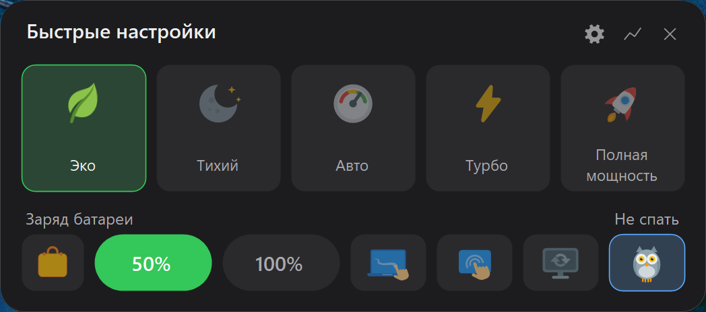
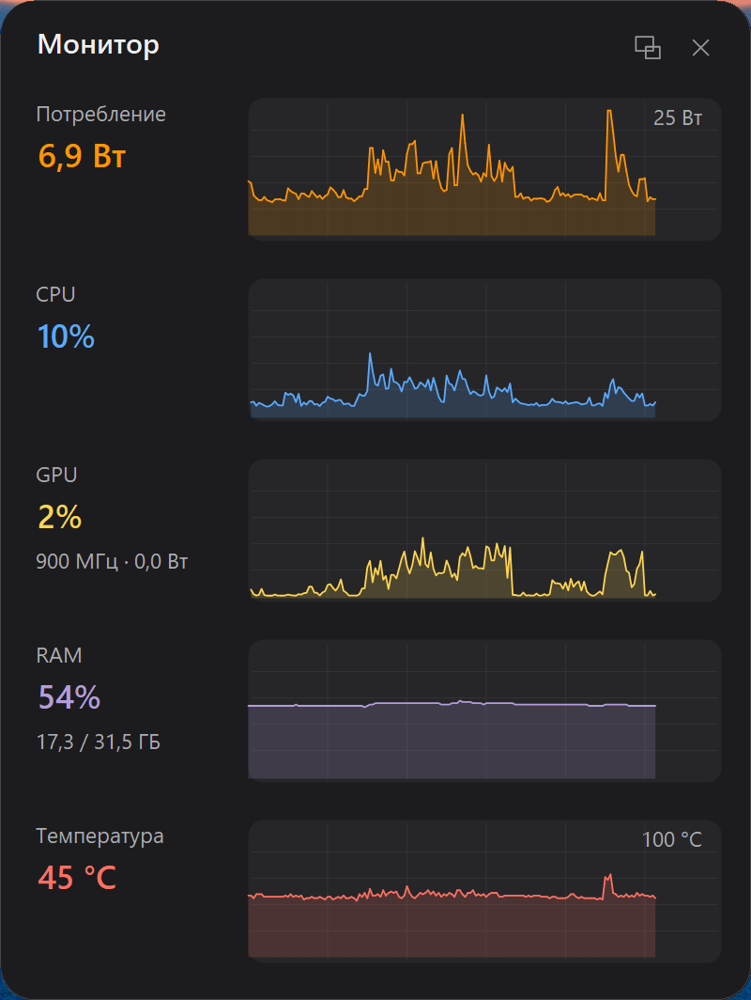

# Xi Control

[](https://github.com/Oksion/XiControl/releases/latest)
[](https://github.com/Oksion/XiControl/releases)
[](https://github.com/Oksion/XiControl/actions/workflows/ci.yml)
[](https://sonarcloud.io/summary/new_code?id=Oksion_XiControl)


[](https://github.com/microsoft/winget-pkgs/tree/master/manifests/o/Oksion/XiControl)
[](https://buymeacoffee.com/3CLiAI1)

🌐 [English](README.md) · **Русский**

Лёгкая утилита в трее для ноутбуков **Xiaomi / Redmi (Redmibook)** — в первую очередь
для **Xiaomi Book Pro 14 (2026)**, на котором она разработана и обкатана, но не только
для него. Защита заряда батареи, режимы производительности, OSD и «оживление»
фирменных клавиш.

Всё управление идёт **через штатный WMI-интерфейс прошивки** (`MiCommonInterface`, ODM Bitland «MIFS») —
тот же канал, которым пользуется официальный Xiaomi PC Manager.
**Никакого WinRing0**, никаких сторонних драйверов и прямого доступа к EC.

<p align="center">
  
</p>

*Панель быстрых настроек (удержание кнопки Mi): пять режимов производительности,
лимит заряда, «В дорогу» (разовый заряд до 100%), тачпад и сенсорный экран вкл/выкл,
авто-герцовка и «режим совы» (не спать).*

<p align="center">
  
</p>

*Окно «Монитор»: живые графики потребления (Вт), загрузки CPU, GPU и RAM.*

<p align="center">
  
  &nbsp;&nbsp;
  
</p>

*В полном виде — живые графики: потребление (Вт), CPU, **GPU** (под процентом — частота и ватты),
RAM, **температура** «горячей точки» (горячая зона — вишнёвым) и мощность подключённого адаптера.
Сворачивается в компактную строку (Power / CPU / GPU / RAM) или в один показатель ватт — кнопкой
«вид» или двойным кликом; направление тока — цветом (заряд зелёный / разряд оранжевый).*

*Значок в трее меняется по активному режиму:*

<p align="center">
  
</p>

## Возможности

- 🔋 **Защита заряда** — «беречь батарею» с выбираемым порогом (40/50/60/70/80%, выбор в
  Настройки → Батарея) / полный заряд 100%.
  - **ChargeGuard**: прошивка сбрасывает лимит после сна и переключения питания —
    утилита автоматически переустанавливает его.
  - 🧳 **Режим «В дорогу»** — разово зарядить до 100% поверх «беречь батарею»: кнопка-чемоданчик
    в панели / пункт меню. По достижении 100% — OSD и звуковой сигнал; при отключении зарядника
    режим сам сбрасывается (следующее подключение снова порог).
- 🔌 **Мощность зарядника** — при подключении зарядки показываем мощность подключённого
  PD-адаптера (ватты) в OSD и в «Мониторе». Поверх иконки заряда — **бейдж качества блока**:
  🔴 «!» если адаптер слабее заданного порога (медленный заряд), ⚪ «?» если блок не-PD (например
  обычный 5 В — мощность не согласуется). При этом иконка по-прежнему показывает текущий лимит заряда.
  Порог настраивается (Настройки → Батарея). Driver-free (только чтение).
- 🩺 **Здоровье батареи** — Настройки → Батарея: реальный износ (текущая ёмкость к проектной),
  число циклов заряда, ёмкость в Вт·ч. Штатные данные ACPI/Windows, только чтение.
- ⚡ **Режимы производительности**: Эко / Тихий / Баланс / Авто /
  Турбо / Полная мощность. **Любой можно убрать с глаз** в Настройки → Производительность —
  два остаются всегда, чтобы было из чего выбирать. **И обычно этого делать не придётся:**
  режим, который прошивка отвергла и от сети, и от батареи, отключается сам — набор зависит
  от модели (на Book Pro 14 не принимается Баланс, на Redmi Book Pro 15 2022 работают только
  Тихий и Баланс). Принудительно ничего не перебирается: учимся на том, что ты выбрал сам.
- 🖥️ **OSD-оверлей** (тёмная карточка, авторские иконки):
  - подключение/отключение зарядки («Зарядка до X%» с реальным порогом / «Работа от батареи» + уровень);
  - смена режима производительности и лимита заряда;
  - микрофон вкл/выкл, подсветка клавиатуры (выкл / 50% / 100% / авто).
- 🅼 **Mi-кнопка**:
  - короткое нажатие — циклическое переключение режимов с OSD (настраивается);
  - двойной клик — переключение лимита заряда (настраивается);
  - удержание — панель быстрых настроек (режимы + лимит заряда, закрытие по Esc/X/клику вне;
    настраивается).
- ⌨️ **Оживление «мёртвых» клавиш** с переназначением: на клики Mi и клавиши
  «настройки» / AI / «проекция» вешается любая функция — от цикла режимов до запуска
  своей программы (см. «Переназначение клавиш»); клавиша микрофона мьютит системный
  микрофон, клавиша подсветки показывает OSD с уровнем.
- 🎛️ **Остальные штатные клавиши тоже отвечают** — настраивать ничего не нужно. Xi Control
  разбирает тот же диспетчер прошивки, который слушает штатная утилита, поэтому Caps Lock,
  Num Lock, блокировка клавиши Windows и индикатор тачпада получают локализованный OSD,
  клавиши «ножницы» и «представление задач» делают то, что нарисовано на них, а клавиша режима
  производительности заодно обновляет значок в трее и запоминаемый режим. Что именно есть —
  зависит от модели: ноутбук, который не шлёт код, просто не покажет соответствующий OSD.
- 🖱️ **Тачпад вкл/выкл** — действие для любой клавиши + ячейка в панели. Отключение
  штатное (как в Диспетчере устройств, без драйверов) и не переживает перезагрузку —
  залипнуть выключенным тачпад не может.
- 👆 **Сенсорный экран вкл/выкл** — то же самое для тачскрина ноутбука: действие для
  клавиши, ячейка в панели, штатное отключение без драйверов и авто-включение после
  перезагрузки. Ячейка появляется только если сенсорный экран в системе есть.
- 🔔 **Проверка обновлений** (по умолчанию включена) — раз в сутки утилита спрашивает у GitHub,
  вышла ли новая версия, и показывает всплывашку со ссылкой на релиз; отметка появляется и на
  вкладке «О программе». Обновление **не ставится само** — только оповещение (обновиться можно со
  страницы релиза или `winget upgrade Oksion.XiControl`). Тумблер выключен — приложение **не делает
  ни одного сетевого запроса**, а проверить можно разово кнопкой.
- ⚙️ **Окно «Настройки»** в стиле Windows 11 — все опции по вкладкам (Общие / Функции /
  Батарея / Экран / Тачпад / Производительность / Клавиши / HTTP API / О программе), тёмная и
  светлая темы.
  Вкладка **«Функции»** — что показывать: «Режим совы», тачпад, сенсорный экран и
  управление частотой; выключенная функция исчезает из меню и панели целиком.
- 🎨 Значок в трее меняется по режиму, монохром под светлую/тёмную панель задач;
  тёмное меню в тон системной теме (переключается на лету).
- 🦉 **«Режим совы»** — не засыпать и не гасить экран *(опционально)*; закрытая крышка
  на питании от сети лишь выключает экран (на батарее — штатный сон). Сова в панели /
  галочка в меню; тайминги электропитания не изменяются, действие крышки восстанавливается.
  Если сова нужна только чтобы система не уснула (например, ради удалённого доступа) —
  `"OwlIgnoreDisplay": true` в конфиге, и экран будет гаснуть как обычно, не выгорая впустую.
  Можно скрыть фичу целиком (`"OwlMode": false` в конфиге).
- 🖥️ **Авто-герцовка** — подключил зарядку → экран 120 Гц, отключил → 60 Гц
  (частоты настраиваются в конфиге: `AcRefreshRate`/`BatteryRefreshRate`; если такой
  частоты у панели нет — берётся ближайшая). Переключатель в меню и ячейка в панели;
  держится после сна и смены питания. Можно скрыть управление частотой целиком
  (Настройки → Функции или `"RefreshRateFeature": false`) — уйдут пункт меню, ячейка панели
  и раздел частоты во вкладке «Экран» (сама вкладка остаётся — там живёт яркость).
- 🔌 **Профили питания** — свой режим производительности при зарядке и от батареи
  («Не менять» — не трогать). Применяется на старте и при смене питания; driver-free (WMI прошивки).
- 💡 **Запоминание яркости** — отдельная опция (без профилей): яркость экрана
  запоминается и восстанавливается отдельно для сети и батареи (WMI ACPI, тот же канал,
  что у Windows).
- 🌗 **Лимит яркости** — максимум яркости отдельно для сети и батареи (бережёт OLED-панель
  от выгорания): превышение плавно возвращается к лимиту, причём не ультиматумом, а «торгом» —
  раз в минуту на половину разрыва; поднимешь снова — утилита уступит на 2 часа. См.
  «Лимит яркости экрана» ниже.
- 🔆 **Авто-яркость по датчику освещённости** *(если датчик есть)* — экран следует за светом
  по кривой, которая **учится на твоих правках**: поправил яркость — при таком освещении она
  теперь будет такой. Кривых две (сеть и батарея), в настройках — живые люксы и график
  обучения. См. «Авто-яркость по датчику» ниже.
- 📟 **Индикатор в трее** *(опционально, по умолчанию выключен)* — второй значок рядом с иконкой
  приложения: цифрой показывается потребление (Вт), загрузка CPU или GPU, занятая память или
  температура. Точное значение с единицами — в тултипе, клик открывает «Монитор», период
  обновления настраивается (Настройки → Общие). Выключен — не создаётся ни значок, ни таймер,
  ни источники данных: ноль дополнительной нагрузки.
- 🌐 Язык интерфейса: русский / английский / китайский (中文).
- 🚀 Автозапуск через Планировщик заданий (без UAC-запроса при входе, работает на батарее).
- 🛰️ **HTTP API для локальной сети** (опционально, по умолчанию **выключен**) — управляй с
  телефона или из автоматизаций Home Assistant: чтение статуса и заряда (`GET /status`),
  переключение режима, защиты заряда, «В дорогу» и совы. Белый список команд, авторизация по
  токену (хранится только SHA-256), bind на `127.0.0.1` по умолчанию — доступ из сети включается
  отдельным тумблером. См. «HTTP API» ниже.

## Совместимость

Проверено на **Xiaomi Book Pro 14** (TM2424). Должно работать на ноутбуках Xiaomi/Redmi
производства ODM Bitland с WMI-классом `MiCommonInterface` (большинство Redmibook / Xiaomi Book
последних поколений).

Проверить свою машину (PowerShell):

```powershell
Get-CimClass -Namespace root/wmi -ClassName MiCommonInterface
```

Если класс нашёлся — интерфейс есть. Набор поддерживаемых функций зависит от модели
(утилита определяет их в рантайме и не падает на неподдерживаемых).

## Установка

Проще всего — через [winget](https://learn.microsoft.com/ru-ru/windows/package-manager/winget/):

```powershell
winget install Oksion.XiControl
```

Или готовый exe — на [странице релизов](../../releases):

- `XiControl-vX.X.X-win-x64.exe` — самодостаточный, ничего ставить не нужно (~70 МБ);
- `XiControl-vX.X.X-win-x64-net8.exe` — лёгкий (~2 МБ), требует
  [.NET 8 Desktop Runtime](https://dotnet.microsoft.com/download/dotnet/8.0).

Запуск — от администратора (это требование WMI-интерфейса прошивки — даже чтение
без elevation не работает).

### Портативный режим

По умолчанию настройки лежат в `%APPDATA%\XiControl\`. Чтобы утилита хранила всё **рядом с
собой** — положи в папку с `XiControl.exe` пустой файл **`portable.txt`** (или `.portable`, если
умеешь такие создавать). Тогда `config.json` и `log.txt` будут жить там же: папку можно унести
на другой диск, флешку или пережить переустановку Windows, ничего не потеряв.

- Настройки, накопленные раньше, **переносятся автоматически** при первом запуске с меткой —
  начинать с нуля не придётся.
- Метка не нужна, если ты просто положишь рядом с exe готовый `config.json` — утилита увидит его
  сама и будет писать туда.
- Если папка с программой **недоступна для записи** (например, установка через winget в
  `Program Files`), портативный режим не включится: настройки останутся в `%APPDATA%`, а причина
  запишется в журнал — молча потерять их утилита не может.
- Текущие пути всегда видны в **Настройки → О программе**.
- Исключение — `api.json` (настройки HTTP API): он **остаётся в `%ProgramData%`** сознательно.
  Файл защищён правами «изменять может только администратор», и именно поэтому API нельзя
  включить или подменить его токен правкой пользовательского конфига.
- Автозапуск — задача Планировщика Windows, она по своей природе живёт в системе, а не в папке.

### Антивирусы и ложные срабатывания

Xi Control не подписан сертификатом, работает от администратора и правит системные вещи
(лимит заряда в прошивке, частоту экрана, правило брандмауэра для опционального HTTP API,
задачу автозапуска) — некоторым «слишком умным» эвристикам этого набора хватает, чтобы
занервничать. Проверить легко: залейте exe на [VirusTotal](https://www.virustotal.com/) —
как правило, из ~70 движков срабатывает разве что **Bkav Pro** (generic-сигнатура вида
`W32.Malware.*`), а **Microsoft Defender и все остальные молчат**. Движок Bkav построен
на AI/ML-эвристике — это позиционирование самого вендора, и их generic-детект так и
называется, `W32.AIDetectMalware`. Такой анализ ищет «подозрительные» паттерны кода,
общие и для легитимных, и для вредоносных программ, — отсюда его печальная слава по
ложным срабатываниям. Это ложный сигнал, и это не наш баг.

Почему сборке можно доверять:

- **исходный код открыт** — читайте и компилируйте сами;
- **релизы собираются в GitHub Actions** из этого репозитория (видно в логах Actions),
  а не «с чьего-то ноутбука»;
- exe воспроизводится командой `dotnet publish` (ниже) — сверьте сами.

Так что если антивирус заругался — это повод извиниться ему, а не паниковать вам. При
желании отправьте файл вендору как false positive: такие generic-сигнатуры обычно
отваливаются со следующим обновлением баз.

Сборка из исходников:

```powershell
dotnet build XiControl.sln -c Release
# → src/bin/x64/Release/net8.0-windows/XiControl.exe
dotnet test XiControl.sln -c Release --no-build   # юнит-тесты (железо не требуется)
```

Один переносимый .exe (без установленного .NET):

```powershell
dotnet publish src/XiControl.csproj -c Release -r win-x64 --self-contained -p:PublishSingleFile=true
```

## Использование

Запусти `XiControl.exe` (подтверди UAC) — появится значок в трее.

| Действие | Результат |
|----------|-----------|
| Клик по значку в трее | Панель быстрых настроек |
| Правый клик по значку | Меню: заряд, «В дорогу», сова, авто-герцовка, «Монитор», режим, «Настройки…», выход |
| Mi-кнопка, одинарный клик | Следующий режим производительности + OSD *(настраивается)* |
| Mi-кнопка, двойной клик | Переключение лимита заряда порог ↔ 100% + OSD *(настраивается)* |
| Mi-кнопка, удержание ~0.5 с | Панель быстрых настроек *(настраивается)* |
| Клавиша микрофона | Мьют/анмьют системного микрофона + OSD |
| Клавиша «настройки» | Переключение лимита заряда порог ↔ 100% + OSD *(настраивается)* |
| Клавиша подсветки клавиатуры | OSD с уровнем (выкл / 50% / 100% / авто) |

Все опции собраны в окне **«Настройки…»** (пункт меню трея): вкладки Общие (язык,
автозапуск, тема панелей, проверка обновлений, логирование), Функции
(сова, тачпад, сенсорный экран, управление частотой), Батарея (порог заряда с пояснением,
звук и файл «В дорогу», звук и уведомление на локскрине, OSD мощности зарядника, порог
«слабого блока», здоровье батареи), Экран (лимит и запоминание яркости; авто-герцовка,
«Удерживать частоту» и частоты — раздел скрыт, если управление частотой выключено),
Тачпад (мёртвая зона у нижнего края),
Производительность (видимость режимов, режим при старте, профили питания), Клавиши
(переназначение), HTTP API (порт, токен, разрешения) и О программе (версия, модель с кодом
платы, BIOS, серийный номер — по умолчанию замаскирован, клик раскрывает). Быстрые
переключатели (заряд, «В дорогу», сова, герцовка, «Монитор», режим) остаются в меню трея и панели.

Тонкие тайминги правятся только в `%APPDATA%\XiControl\config.json` (применяются при
следующем запуске): `MiHoldMs` — порог удержания Mi-кнопки (400), `MiDoubleClickMs` — окно
двойного клика (300), `OsdDurationMs` — сколько висит OSD (2800).

Ключи конфига для настроек из UI (менять руками не нужно, но полезно знать): `CareLimitPercent` —
выбранный порог заряда; `TravelLockSound` / `TravelLockToast` — звук и уведомление «В дорогу» на
заблокированном экране; `CheckUpdates` — проверять обновления, `SkippedVersion` — версия, о которой
уже сообщали, `LastUpdateCheckUtc` — время последней проверки (суточное окно).

Для автозапуска включи «Запускать при входе в Windows» (Настройки → Общие) — задача
планировщика создаётся с повышенными правами, поэтому при входе UAC-запрос не показывается.
Задача **своя у каждой учётной записи** (имя вида `XiControl_S-1-5-21-…`), так что на общем
компьютере пользователи не перетирают автозапуск друг другу; задача от прежних версий
(просто `XiControl`) распознаётся и переносится на новое имя при следующем переключении.
Самопочинка при запуске срабатывает не только если exe пропал, но и если задача поднимает
**устаревшую сборку** — типичный случай, когда portable-версию распаковали в новую папку.
Кроме входа в систему задача срабатывает на возврат в сеанс при быстром переключении
пользователей.

### Режим «В дорогу» (разовый заряд до 100%)

Обычно держишь «беречь батарею» (скажем, 80%), но перед поездкой хочется полный заряд. Нажми
**кнопку-чемоданчик** в панели (слева от пилюль «порог/100») или пункт **«Зарядить „в дорогу"»**
в меню — утилита разово снимет ограничение и дозарядит до 100%.

- По достижении **100%** — OSD «можно в дорогу» и звуковой сигнал (переключатель
  **Настройки → Батарея → «Звук готовности»**, по умолчанию вкл).
- **Отключил зарядник → режим сам выключается**; следующее подключение снова бережёт до порога.
- Ручной выбор пилюли «порог/100» тоже отменяет режим. При постоянном «100%» кнопка неактивна
  (дозаряжать некуда).

Пилюли «порог/100» показывают **базовую** настройку — «В дорогу» это временный оверрайд поверх неё
(driver-free, тот же WMI-канал заряда). В `config.json`: `"TravelMode"`, `"TravelSound"`.

Свой звук готовности — поле «Свой звуковой файл» там же в настройках (или `config.json`;
пусто или файл не найден → встроенный джингл; поддерживаются `%ПЕРЕМЕННЫЕ%`; только WAV/PCM):

```json
"TravelSoundFile": "C:\\Users\\Me\\Sounds\\ready.wav"
```

### Скрыть ненужные режимы

Тумблеры **Настройки → Производительность → «Показывать режим „Эко“» / «Показывать
„Полную мощность“»** (применяется сразу; панель при этом не сжимается — ячейки оставшихся
режимов растягиваются). То же самое в `%APPDATA%\XiControl\config.json`
(скрытый режим включить из приложения станет нельзя):

```json
"EcoMode": false,
"FullSpeedMode": false
```

- **Эко** — самый экономный профиль: на проверенной модели гасит подсветку клавиатуры и
  снижает яркость экрана. В родном софте он тоже есть — скрытым он был только *от нас*:
  протокол незадокументирован, и его код пришлось искать руками;
- **Полная мощность** — если не пользуешься или хочешь исключить случайное включение
  (режим шумный и работает только от сети).

По умолчанию оба показываются. После правки конфига вручную перезапусти приложение.

### Режим производительности при старте

Прошивка сбрасывает режим при перезагрузке. Что включать на старте — радио-выбор
**Настройки → Производительность → «Режим при старте»** (взаимоисключающие; четвёртый,
«Профили питания», — ниже):

- **Не трогать** — оставлять то, что выставила прошивка.
- **Восстанавливать последний** — приложение запоминает выбранный режим и возвращает его после
  перезагрузки (следует за твоими переключениями). При включении сразу запоминает текущий.
- **Закрепить текущий** — фиксирует **один** режим: он будет включаться каждый старт,
  с какого бы ни выключились. Выбираешь, находясь в нужном режиме, — он закрепляется.

Если нужный режим на старте недоступен (например, «Полная мощность» на батарее) — включится «Авто».

Закреплённый режим можно задать и правкой `config.json`: `"ForceStartMode": "Eco"` (допустимо
`"Quiet"` / `"Turbo"` / `"FullSpeed"` / `"Auto"` / `"Eco"`; `null` или удалить строку — снять).

### Профили питания (режим по питанию)

Четвёртый вариант «Режима при старте»: **свой режим производительности при зарядке и от
батареи**. Выбирается там же — **Настройки → Производительность → «Профили питания»**;
под радио-выбором появляются «Режим при зарядке» и «Режим от батареи» (или «Не менять»).

```json
"PowerProfiles": true,
"AcPerfMode": "Turbo",       // режим от сети; null или "Не менять" — не трогать
"BatteryPerfMode": "Quiet"   // режим от батареи
```

- **Профиль применяется на старте и при каждой смене питания** сеть↔батарея (и после сна),
  через гард с дебаунсом — как у защиты заряда и авто-герцовки. Driver-free: WMI прошивки `0x08`.
- Если прошивка не приняла режим (например, «Полная мощность» на батарее) — мягкий откат на «Авто».

### Запоминание яркости экрана

Отдельная опция **Настройки → Экран → «Запоминать яркость экрана»** (по умолчанию **выкл**),
работает независимо от «Профилей питания». Утилита следит за твоей яркостью отдельно для сети
и батареи и восстанавливает её при каждом переходе: выставил 80 % на зарядке → при следующем
подключении вернётся 80 %. Driver-free: WMI `WmiMonitorBrightness*` (ACPI-подсветка, тот же
канал, что у Windows).

- XiControl при этом **перебивает яркость Windows** своим значением — поэтому опция и
  включается явно; на переходе возможна кратковременная двойная подстройка (Windows → через
  ~1.5 с наше). `AcBrightness`/`BatteryBrightness` в конфиге заполняются сами.
- Смена режима и яркости — **в фоне** (UI не блокируется); на панели без WMI-яркости фича молча
  деградирует (пишет в `log.txt`, не падает). Запись конфига дебаунсится (бережём SSD).

### Лимит яркости экрана

**Настройки → Экран → «Ограничивать яркость»** (по умолчанию **выкл**) + два лимита — свой для
сети и свой для батареи. Задумано для OLED-панели: постоянная высокая яркость ускоряет выгорание,
а лимит мягко не даёт ей там жить. Driver-free — тот же WMI-канал ACPI-подсветки.

Сразу честно: **заблокировать сам ползунок Windows невозможно** — такого API нет. Утилита может
только вернуть яркость после факта, поэтому возврат сделан максимально ненавязчивым:

- Превышение снижается **плавно** (~10 с на весь путь, шагами по 1%), не скачком.
- **«Вежливый торг» вместо ультиматума**: выставил 80 при лимите 60 — утилита не отматывает сразу,
  а раз в минуту сокращает разрыв вдвое: 80 → 70 → 65 → 63 → … → 60. Остаток ≤2% доводится сразу.
- **Поднял яркость снова после её шага** — это сигнал «мне правда нужно ярче»: утилита уступает и
  **не трогает яркость 2 часа**. Пауза сбрасывается блокировкой сеанса, сном, сменой питания и
  перезапуском приложения.
- **Понижение ниже лимита не трогается вовсе** — утилита никогда не поднимает яркость.
- **С адаптивной яркостью Windows лимит не работает** (иначе двое управляли бы яркостью
  одновременно): утилита это замечает и пишет причину прямо на вкладке. Отключить адаптивную:
  Параметры → Система → Дисплей.
- Дружит с «Запоминать яркость»: значения выше лимита **не запоминаются вообще** (а не
  обрезаются) — твоя комфортная яркость в слоте не затирается; при восстановлении слот
  прижимается к текущему лимиту, но в конфиге остаётся нетронутым.

В `config.json`: `BrightnessCapEnabled`, `BrightnessCapAc`/`BrightnessCapBattery` (лимиты, %),
и тонкие тайминги — `BrightnessRampMs` (длительность плавного хода, 10000), `BrightnessConvergeMs`
(интервал между шагами торга, 60000), `BrightnessBackoffMin` (пауза после повторного подъёма, 120),
`BrightnessGapDivisor` (делитель разрыва, 2), `BrightnessSnapPercent` (порог доведения, 2).

Выпадашки в настройках предлагают пресеты через 5% (100–30), но лимит принимает **любой процент**:
впиши в `config.json` хоть `"BrightnessCapBattery": 47` (диапазон 10–100) — окно настроек покажет
твоё значение первым пунктом списка и не перетрёт его, пока сам не выберешь другое.

### Авто-яркость по датчику

**Настройки → Экран → «Авто-яркость по датчику»** (по умолчанию **выкл**; пункт появляется
только если в ноутбуке есть датчик освещённости). Экран следует за светом — но, в отличие от
адаптивной яркости Windows, **по кривой, которая учится на твоих правках**: поправил яркость
руками — приложение запомнило «при таком свете мне нужно столько» и дальше попадает точнее.

- **Работает сразу**, без обучения: из коробки идёт разумная кривая (тёмная комната ≈10%,
  офис ≈60%, улица 100%).
- **Кривых две — для сети и для батареи**: в одних и тех же люксах у розетки хочется ярче,
  чем в дороге. Учится та, при которой ты крутил яркость.
- **Никаких нейросетей и облаков** — простая объяснимая модель из десятка точек, всё лежит
  в твоём `config.json`. На вопрос «почему экран стал таким» всегда есть точный ответ.
- **Обучение не сбрасывается** при выключении фичи — забыть выученное можно только кнопкой
  «Сбросить кривую обучения».
- **Обучение можно выключить** (тумблер «Обучение кривой») — когда кривая уже настроена как
  нравится: правки яркости становятся *временными*, кривая не меняется. Что дальше — решает
  «**Возврат к выученному**»: *Всегда* — через минуту яркость мягко сходится обратно к кривой
  (тот же вежливый торг, что у лимита: половина разрыва раз в минуту, в обе стороны; настоял
  повторной правкой — уступка на 2 часа или до блокировки экрана), *Только от батареи* — от
  сети правка живёт до смены освещения, *Выключен* — не возвращать вовсе. В любом режиме
  смена света, питания или блокировка экрана пересчитывают яркость по кривой — временная
  правка не переживает Win+L. Тайминги — `AutoBrightnessRevertMs`/
  `AutoBrightnessRevertBackoffMin` в config.json.
- **«Инерция датчика»** (0–60 с, по умолчанию 10) — приложение реагирует на *медиану*
  освещённости за это окно: случайный блик, фара или тень руки яркость не дёргают.
- **Видно, что происходит**: на вкладке — текущая освещённость в люксах и живой график обеих
  кривых (сеть — цветом акцента, батарея — оранжевым) с якорными точками и маркером текущего
  света. Поправишь яркость — через несколько секунд точка появится на графике.

Дружит с остальными фичами яркости: **лимит** (см. выше) работает фильтром поверх — кривая
учит твоё настоящее намерение, а лимит просто не пускает выше на выходе (на графике видно,
как он «срезает» кривую); **«Запоминать яркость»** при включённой авто-яркости выключается —
кривая заменяет собой слоты. С **адаптивной яркостью Windows** фича не работает (два
регулятора одного ползунка неизбежно дают качели) и честно пишет об этом в настройках.

В `config.json`: `AutoBrightness`, `AutoBrightnessPointsAc`/`…Battery` (кривые — правятся
сами), `AutoBrightnessMedianSec`, а также тонкие пороги `AutoBrightnessHysteresis`,
`AutoBrightnessSettleMs`, `AutoBrightnessLearnMs`, `AutoBrightnessDeadband`.

> 🤓 Как устроено внутри — логарифмическая шкала, правила вытеснения точек, доказательство
> монотонности кривой, почему медиана, а не среднее: [docs/13-auto-brightness.md](docs/13-auto-brightness.md).

### Авто-герцовка (частота экрана по питанию)

Экран переключается на разную частоту в зависимости от источника питания: от сети — повыше
(плавность), от батареи — пониже (экономия). Включается пунктом меню трея, ячейкой в панели
или в **Настройки → Экран**; там же выбираются частоты (применяются сразу). В `config.json`:

```json
"AutoRefreshRate": true,
"HoldRefreshRate": false,
"AcRefreshRate": 120,
"BatteryRefreshRate": 60
```

Как это ведёт себя на самом деле (чистый Win32: встроенная панель ищется через `QueryDisplayConfig`,
частота ставится `ChangeDisplaySettingsEx` — драйвер не нужен):

- **Только встроенная панель ноутбука**, разрешение и глубина цвета не трогаются — меняется лишь
  частота. Внешние мониторы не затрагиваются, даже если один из них назначен основным; если панель
  сейчас не активна (крышка закрыта, режим «только второй экран») — не меняется ничего.
- **Берётся ближайшая поддерживаемая частота** при текущем разрешении: попросили 120, а панель
  умеет только 90/60 → выберет 90 (при равном расстоянии — большую). Поэтому вписать «144» на
  60-герцовой матрице безопасно — просто останется 60. Значение ≤ 0 в конфиге игнорируется.
- **Срабатывает** на старте приложения, при смене питания сеть↔батарея и при выходе из сна
  (эти два — через дебаунс ~1.5 с, события приходят пачкой), а также сразу при включении опции.
- Если нужная частота **уже стоит — экран не мигает** (лишний вызов не делается).
- Частота пишется в реестр дисплея (`CDS_UPDATEREGISTRY`), т.е. **переживает перезагрузку**;
  но при выключенной опции приложение частоту **не трогает вообще** (в т.ч. в момент снятия галки —
  что стояло, то и останется, вернуть вручную).
- Сама смена видеорежима идёт **в фоновом потоке** (не блокирует UI), а неудача просто пишется
  в `log.txt`, приложение не падает. OSD смены питания дописывает фактическую частоту («… • 120 Гц»).
- На поддерживаемых моделях Xiaomi клавиша герцовки (`0x1A`, совместимый алиас `0x13`)
  перебирает доступные режимы встроенной панели и показывает итоговую частоту в локализованном
  OSD. При включённом **«Удерживать частоту»** этот осознанный выбор становится значением профиля
  текущего питания, поэтому guard не отменяет его через 1,5 секунды.

При правке `AcRefreshRate`/`BatteryRefreshRate` прямо в конфиге перезапусти приложение
(выбор в окне настроек применяется сразу; нестандартное значение из конфига окно тоже покажет).

**«Удерживать частоту»** (`HoldRefreshRate`, по умолчанию выкл) — отдельный тумблер там же, в
**Настройки → Экран**. С ним авто-герцовка следит не только за питанием, но и за самим экраном:
если режим сменил кто-то извне — параметры Windows, чужая утилита, драйвер после сброса — заданная
частота возвращается через тот же дебаунс ~1.5 с. Без него настройка тихо не держится до следующего
события питания. Работает поверх авто-герцовки (без неё возвращать нечего), поэтому пока она
выключена — тумблер погашен. Опроса нет: только системное событие смены режима экрана.

> Побочный эффект, он же суть фичи: пока опция включена, сменить частоту через параметры Windows
> не выйдет — вернём быстрее, чем система успеет спросить «Сохранить изменения?». Нужно поменять
> руками именно там — выключи тумблер; поддерживаемая аппаратная клавиша продолжает работать.

### Индикатор в трее

Опциональный второй значок рядом с иконкой приложения: цифрой показывается одна из метрик —
потребление (Вт, с датчика батареи), загрузка CPU или GPU, занятая память или температура
(Intel DPTF). Включается в **Настройки → Общие**, там же выбираются метрика и период
обновления (1/2/5/10 с; правкой `TrayMetricPeriodSec` в конфиге — любое от 1 до 60). Точное
значение с единицами — в тултипе при наведении, клик по значку открывает «Монитор».

Нюансы:

- Windows может спрятать новый значок за шеврон «скрытых значков» — перетащите его на панель
  один раз, место запомнится.
- Потребление честное только от батареи или при зарядке: от сети без заряда датчика нет,
  показывается «—» (как в «Мониторе»). Загрузка GPU требует графики Intel, температура — DPTF;
  недоступная на этом железе метрика тоже показывает «—».
- В выключенном состоянии индикатор не стоит ничего: не создаётся ни значок, ни таймер,
  ни источники данных — ноль дополнительной нагрузки.

### Мёртвая зона у нижнего края тачпада

Если нижний край панели ловит ладонь или большой палец, включи **Настройки → Тачпад →
«Мёртвая зона снизу»** и выбери высоту полосы (8/10/12/15/20 мм, по умолчанию 12). В
`config.json` это `TouchpadDeadZone` и `TouchpadDeadZoneMm`.

Важно понимать, что зона делает: она гасит **начало** касания. Если палец коснулся панели сразу
в этой полосе, курсор не сдвинется и тапа не будет — а вот жест, начатый выше, продолжает
работать до самого низа панели, так что прокрутка и перетаскивание не рвутся. **Нажатие в зоне
по-прежнему срабатывает** — полностью «мёртвой» полоса не становится.

Под капотом это штатная настройка Windows Precision Touchpad (`SuperCurtainBottom`), а не
перехват ввода: одна машинная запись в реестре, никаких драйверов и хуков. Применяется сразу —
приложение перезапускает узел тачпада само, перезаходить в сеанс не нужно (панель на секунду
пропадёт). Выключение опции **удаляет** запись, а не пишет ноль.

> Зона работает внутри защиты от ладони Windows. Если в **Параметры → Bluetooth и устройства →
> Сенсорная панель** выставлена максимальная чувствительность, защита выключена целиком — вместе
> с нашей зоной. XiControl это замечает и пишет предупреждение прямо на вкладке.

### Переназначение клавиш

Каждой клавише — своё действие: **Настройки → Клавиши**. Слоты — одиночный клик, двойной
клик и удержание Mi-кнопки, клавиши «Настройки» (шестерёнка), AI и «Проекция». На любой
слот можно навесить: цикл режимов, лимит заряда вкл/выкл, быструю панель, режим совы,
«Монитор», «В дорогу», тачпад и сенсорный экран вкл/выкл, системные «Проекция (Win+P)» /
«Параметры Windows» / «Copilot (Win+C)», мультимедиа (воспроизведение/пауза, следующий и
предыдущий трек, остановка), калькулятор, запуск своей программы или «Ничего».

Медиа-действия работают с любым плеером — клавишу получает тот, кто владеет медиа-сессией
Windows. Громкости в списке нет намеренно: для неё на клавиатуре есть отдельные кнопки.

Тачпад и сенсорный экран отключаются штатным механизмом Windows (как «Отключить
устройство» в Диспетчере, без драйверов) и **всегда включаются сами после перезагрузки** —
залипнуть выключенными не могут. Их ячейки есть и в быстрой панели, рядом с авто-герцовкой
(ячейка сенсорного экрана — только если тачскрин в системе присутствует).

- Удержание Mi-кнопки по умолчанию открывает быструю панель, но его можно переназначить —
  например, повесить панель на одиночный клик, а на удержание «В дорогу».
- Двойной клик Mi = «Ничего» → жест отключён, одиночный клик срабатывает мгновенно
  (без окна ожидания ~300 мс).
- Удержание Mi = «Ничего» → жест отключён, и долгое нажатие отрабатывает как обычный клик
  (а не пропадает впустую).
- При открытой панели клавиша «Настройки» всегда переключает заряд (пилюля в панели).
- Для «Запустить программу…» подойдёт exe, документ или URL; переменные окружения
  (`%USERPROFILE%` и т.п.) раскрываются, путь с пробелами — в кавычках, после пути
  можно дописать аргументы: `"C:\\Program Files\\App\\app.exe" --flag`. Учти:
  XiControl работает с правами администратора — запущенная программа их унаследует.

В `config.json` это пары `*Action`/`*Command` (`MiClick`, `MiDouble`, `MiHold`, `SettingsKey`,
`AiKey`, `ProjKey`), значения действий: `modes`, `charge`, `panel`, `owl`, `monitor`,
`travel`, `touchpad`, `touchscreen`, `autobright`, `projection`, `settings`, `copilot`, `play`, `next`,
`prev`, `stop`, `calc`, `launch`, `none`:

```json
"MiClickAction": "modes",
"MiDoubleAction": "charge",
"AiKeyAction": "launch",
"AiKeyCommand": "\"C:\\Program Files\\App\\app.exe\" --flag"
```

Старые опции (`MiShortPress`, `MiDoubleClick`, `SettingsKey`, `AiKeyProgram`/`AiKeyArgs`)
переносятся автоматически при первом запуске новой версии.

### Штатные клавиши, которые отвечают без спроса

Кроме переназначаемых слотов выше, прошивка объявляет целое семейство событий клавиш — те же
самые, что слушает штатная утилита производителя. Xi Control разбирает этот диспетчер, поэтому
следующее работает вообще без настройки:

| Клавиша | Что происходит |
|---|---|
| Caps Lock / Num Lock / блокировка клавиши Windows | локализованный OSD с новым состоянием |
| Индикатор тачпада | OSD вкл/выкл (прошивка уже переключила сама) |
| Ножницы | Win+Shift+S |
| Представление задач | Win+Tab |
| Калькулятор | системная клавиша калькулятора |
| Режим производительности | значок в трее, запоминаемый режим и OSD синхронизируются |
| Предупреждение о слабом питании | предупреждающий OSD, если включены ватты зарядника в OSD |

**Что из этого есть на твоём ноутбуке — зависит от модели.** Машина, которая не шлёт код, просто
не покажет соответствующий OSD: ничего не сломано и выключать ничего не надо. Коды, которые мы
узнаём, но которые на этой модели ничего не делают, пишутся в `log.txt`, а не проглатываются, —
по этой строке владелец невиданной нами модели находит свои коды и вписывает их в `KeyCodes`
(см. [docs/07-keymap.md](docs/07-keymap.md)).

Режим производительности — отдельный случай, о котором стоит знать: **показываемый режим
сверяется с прошивкой, а не берётся из события клавиши.** На Redmi Book Pro 15 2022 штатная
клавиша перебирает три режима, а прошивка принимает два — на третьем родной OSD объявляет
переключение, которого не происходит. Xi Control в этом случае молчит, а не повторяет чужое
утверждение.

### HTTP API (управление из локальной сети)

Опциональный веб-API, чтобы дёргать XiControl с телефона или из автоматизаций Home Assistant.
**По умолчанию выключен** — включается в **Настройки → HTTP API**. Там же задаётся порт,
генерируется токен (показывается **один раз** — скопируй сразу; хранится только SHA-256) и
поштучно разрешаются команды. По умолчанию доступно только чтение состояния.

Маршруты (все — с заголовком `Authorization: Bearer <токен>`, тело — JSON):

| Метод / путь | Что делает |
|---|---|
| `GET /status` | Режим, защита заряда, «В дорогу», сова, % заряда, факт зарядки, ватты, здоровье батареи |
| `POST /mode` `{"value":"turbo"}` | Режим производительности (`eco`/`quiet`/`auto`/`turbo`/`fullspeed`) |
| `POST /care` `{"on":true}` | «Беречь батарею» вкл/выкл (настроенный порог) |
| `POST /travel` `{"on":true}` | Режим «В дорогу» (разовый заряд до 100%) |
| `POST /owl` `{"on":true}` | «Режим совы» (не спать) вкл/выкл |

```bash
curl -X POST http://192.168.1.50:58125/travel \
  -H "Authorization: Bearer <токен>" -d '{"on":true}'
```

Безопасность (утилита работает от администратора, поэтому — осознанно и с оговорками):

- **По умолчанию только `127.0.0.1`** — из сети не достучаться даже с токеном. Доступ из
  локалки — отдельный тумблер «Доступ из локальной сети» с предупреждением; тогда создаётся
  правило брандмауэра со скоупом **LocalSubnet** (только твоя подсеть) и удаляется при выключении.
- **Белый список команд зашит в код** — настройки, автозапуск и запуск программ через API
  невозможны; выключенная команда отвечает `403`, неизвестный путь — `404`, без токена — `401`.
- **Настройки API — в `%ProgramData%\XiControl\api.json` под ACL «запись только администраторам»**:
  сторонний процесс без прав администратора не может ни включить сервер, ни подменить токен.
- Плейнтекст-HTTP (без TLS) — сознательный компромисс: радиус поражения белого списка мал.

Ничего из этого не работает и не тратит ресурсы, пока API выключен (сервер попросту не запускается).

## Ограничения

- Порог «беречь батарею» выбирается из дискретного набора прошивки — произвольный процент
  через WMI невозможен. На проверенной модели (TM2424) это 40/50/60/70/80/100%; на других
  моделях набор может отличаться (прошивка сама валидирует его и отвергает неподдержанные уровни).
- Комбинация Fn+Mi не отличима от одиночной Mi (прошивка шлёт одинаковые события),
  поэтому используется короткое/длинное нажатие.
- Набор функций зависит от модели: прошивочная телеметрия (обороты вентиляторов) на проверенной
  машине не поддерживается. **Температуру** при этом показываем — не из прошивки, а через Intel DPTF
  (WMI `EsifDeviceInformation`), строкой-графиком в «Мониторе».
- **Загрузка GPU** идёт через Intel IGCL — user-mode API графического драйвера (`ControlLib.dll`
  из System32, ставится вместе с драйвером Intel; прав администратора не требует). На машинах без
  графики Intel ряд GPU в «Мониторе» просто не появляется. Температуру и обороты вентиляторов этот
  канал на встроенном GPU не отдаёт — только загрузку, мощность и частоту.

## Как это работает

Протокол MIFS разобран и задокументирован в [docs/](docs/):

- [01-wmi-protocol.md](docs/01-wmi-protocol.md) — транспорт, формат буфера, коды команд, события клавиш (**главный документ**);
- [02-feature-catalog.md](docs/02-feature-catalog.md) — каталог функций;
- [03-architecture.md](docs/03-architecture.md) — архитектура приложения;
- [07-keymap.md](docs/07-keymap.md) — карта кодов клавиш;
- [13-auto-brightness.md](docs/13-auto-brightness.md) — математика обучаемой кривой авто-яркости 🤓.

Коротко: метод `MiInterface` принимает 32-байтовый буфер
(`[1]` — GET `0xFA` / SET `0xFB`, `[3]` — команда, `[4]/[6]` — аргументы) и возвращает
статус в `OUT[1]` (`0x80` — ок). Заряд — команда `0x10`, режимы — `0x08`,
события клавиш приходят WMI-событием `HID_EVENT20`.

Протокол восстановлен по открытым источникам (включая драйвер ядра Linux) **без копирования чужого кода** —
переносились только факты об интерфейсе. Подробности и лицензии источников: [docs/04-references.md](docs/04-references.md).

## Разработка

```
src/            приложение (C# / .NET 8 / WinForms): Wmi/ — протокол MIFS, Input/ — клавиши
                и жесты, Ui/ — трей, панель, OSD, монитор, настройки (Ui/Settings/ — вкладки),
                SystemIntegration/ — guard-ы, питание, тачпад/экран, Config/, Localization/
tests/          юнит-тесты (xUnit) чистой логики на фейках — гоняются без железа Xiaomi
assets/svg/     иконки: osd/ — цветные 128×128, tray/ — монохром 24×24 (currentColor),
                ui/ — неквадратные картинки интерфейса (кнопка Buy Me a Coffee)
assets/sound/   встроенные WAV-джинглы режима «В дорогу»
tools/          IconPreview/ — рендер иконок в PNG + генерация app.ico; вспомогательные скрипты
docs/           документация протокола и архитектуры
reference/      PowerShell-пробы, журналы исследования прошивки
```

Как устроен код (командный слой, швы для тестов, guard-паттерн) — [CLAUDE.md](CLAUDE.md),
как контрибьютить — [CONTRIBUTING.md](CONTRIBUTING.md).

Диагностика: ошибки пишутся в `%APPDATA%\XiControl\log.txt`.

История изменений: [CHANGELOG.md](CHANGELOG.md) · Планы: [ROADMAP.md](ROADMAP.md)

## Лицензия

[GPL-3.0](LICENSE).

Утилита пригодилась? Можно [угостить кофе ☕](https://buymeacoffee.com/3CLiAI1).
